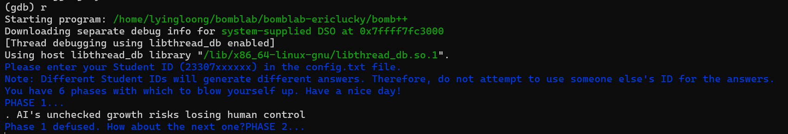
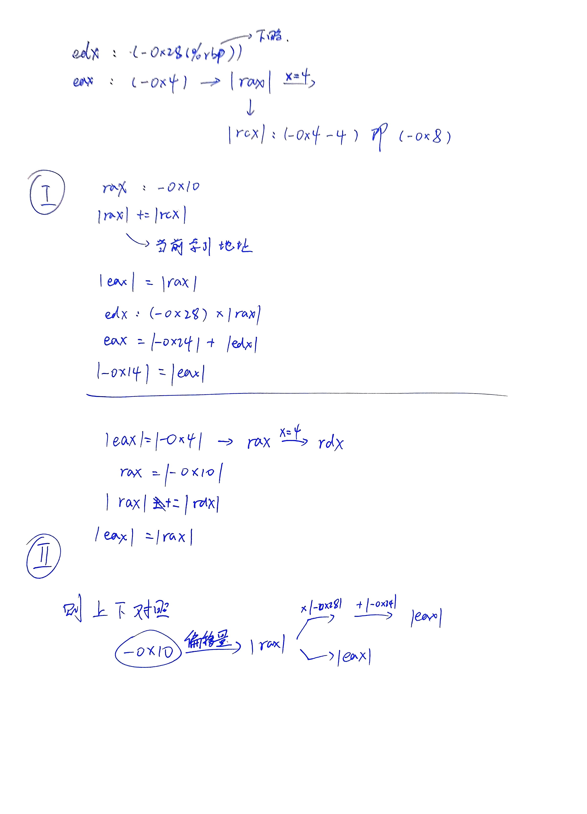
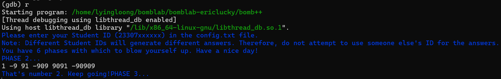
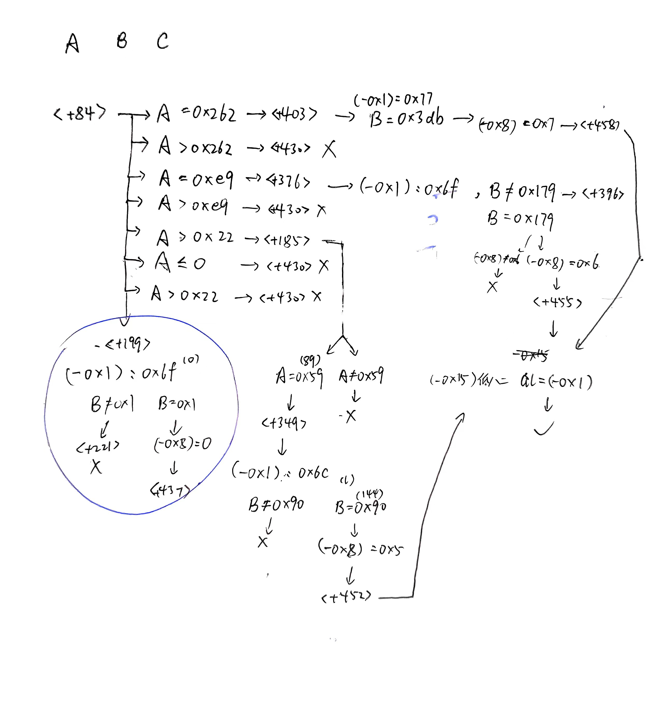
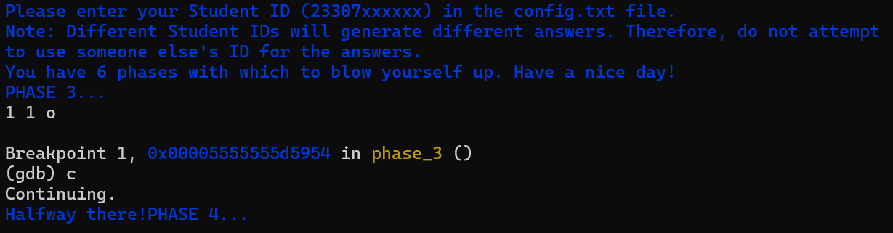
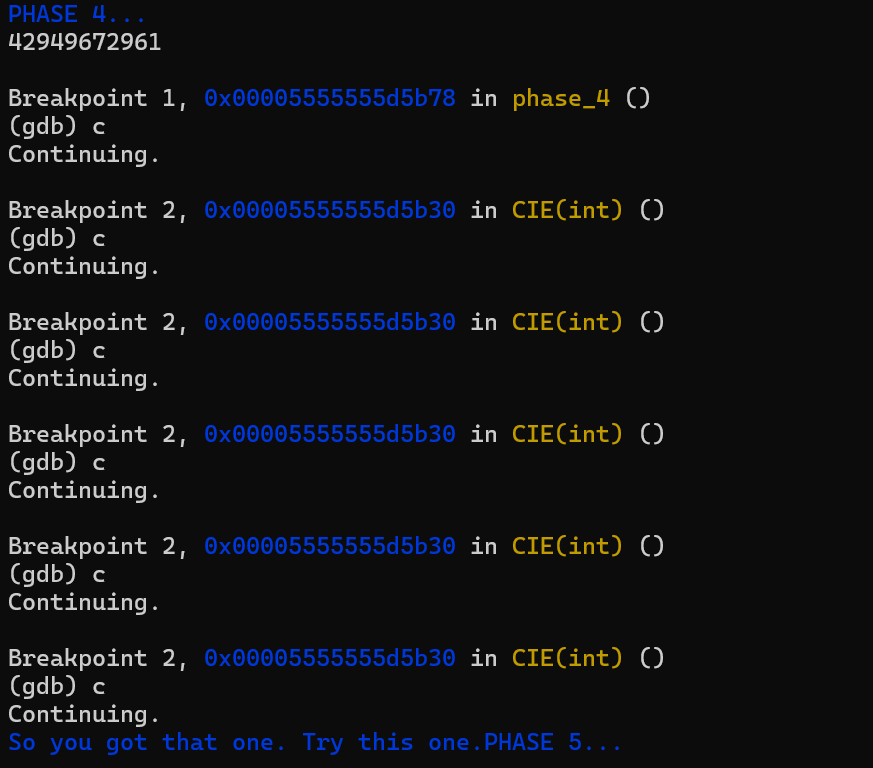
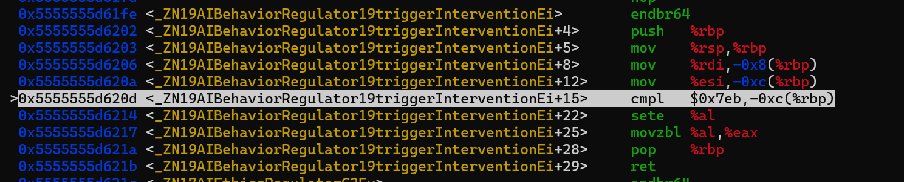

<h1 align="center">BombLab Report</h1>

<h6 align="center">王沈捷</h6>

<h6 align="center">21302010016</h6>

## Phase_1

##### Disas phase_1

```asm
Dump of assembler code for function phase_1:
   0x00000000000817d2 <+0>:     endbr64
   0x00000000000817d6 <+4>:     push   %rbp
   0x00000000000817d7 <+5>:     mov    %rsp,%rbp
   0x00000000000817da <+8>:     sub    $0x20,%rsp
   0x00000000000817de <+12>:    mov    %rdi,-0x18(%rbp)
   0x00000000000817e2 <+16>:    mov    0x4231a8(%rip),%ecx        # 0x4a4990 <ID_hash>
   0x00000000000817e8 <+22>:    mov    %ecx,%edx
   0x00000000000817ea <+24>:    mov    $0xcccccccd,%eax
   0x00000000000817ef <+29>:    imul   %rdx,%rax
   0x00000000000817f3 <+33>:    shr    $0x20,%rax
   0x00000000000817f7 <+37>:    mov    %eax,%edx
   0x00000000000817f9 <+39>:    shr    $0x3,%edx
   0x00000000000817fc <+42>:    mov    %edx,%eax
   0x00000000000817fe <+44>:    shl    $0x2,%eax
   0x0000000000081801 <+47>:    add    %edx,%eax
   0x0000000000081803 <+49>:    add    %eax,%eax
   0x0000000000081805 <+51>:    sub    %eax,%ecx
   0x0000000000081807 <+53>:    mov    %ecx,%edx
   0x0000000000081809 <+55>:    mov    $0xd7,%eax
   0x000000000008180e <+60>:    sub    %edx,%eax
   0x0000000000081810 <+62>:    mov    %eax,0x42317e(%rip)        # 0x4a4994 <phase_1_offset>
   0x0000000000081816 <+68>:    mov    0x423178(%rip),%eax        # 0x4a4994 <phase_1_offset>
   0x000000000008181c <+74>:    cltq
   0x000000000008181e <+76>:    lea    0x4207fb(%rip),%rdx        # 0x4a2020 <phase_1_str>
   0x0000000000081825 <+83>:    add    %rdx,%rax
   0x0000000000081828 <+86>:    mov    %rax,-0x8(%rbp)
   0x000000000008182c <+90>:    mov    -0x8(%rbp),%rdx
   0x0000000000081830 <+94>:    mov    -0x18(%rbp),%rax
   0x0000000000081834 <+98>:    mov    %rdx,%rsi
   0x0000000000081837 <+101>:   mov    %rax,%rdi
   0x000000000008183a <+104>:   call   0x8176f <string_not_equal>
   0x000000000008183f <+109>:   xor    $0x1,%eax
   0x0000000000081842 <+112>:   test   %al,%al
   0x0000000000081844 <+114>:   je     0x8184b <phase_1+121>
   0x0000000000081846 <+116>:   call   0x7de1f <explode_bomb>
   0x000000000008184b <+121>:   nop
   0x000000000008184c <+122>:   leave
   0x000000000008184d <+123>:   ret
End of assembler dump.
```

发现醒目的<phase_1_str>,查看内容

```asm
(gdb) x/s 0x4a2020
0x4a2020 <phase_1_str>: "In 2024, the rapid advancement of AI continues to reshape society, but it also raises growing concerns. AI systems are becoming increasingly autonomous, often outpacing regulatory frameworks and ethic"...
```

得到的<phase_1_str>是一个长字符串，且无法完全显示。

但由此可猜测：谜底可能是以<phase_1_str>为基础，根据我们提供的学号进行某种截取或移位操作得到的子字符串。

对代码中的关键步<string_not_equal>打断点调试

```asm
(gdb) b string_not_equal
Breakpoint 3 at 0x5555555d5777
```

在断点处查看寄存器

```asm
Breakpoint 3, 0x00005555555d5777 in string_not_equal ()
(gdb) p $rdx
$2 = 93824997089525
(gdb) x/s $rdx
0x5555559f60f5 <phase_1_str+213>:       ". AI's unchecked growth risks losing human control"
```

即得到答案	**. AI's unchecked growth risks losing human control**



## Phase_2

##### Disas

```asm
Dump of assembler code for function phase_2:

	# 初始化一个80字节的空间
   0x00000000000818ba <+0>:     endbr64
   0x00000000000818be <+4>:     push   %rbp
   0x00000000000818bf <+5>:     mov    %rsp,%rbp	# rsp（Register Stack Pointer）默认指向当前栈顶
   0x00000000000818c2 <+8>:     sub    $0x50,%rsp
   
   0x00000000000818c6 <+12>:    mov    %rdi,-0x48(%rbp)   # -0x48：rdi
   0x00000000000818ca <+16>:    lea    -0x40(%rbp),%rax   # （rax）：-0x40
   0x00000000000818ce <+20>:    mov    %rax,%rdi	# （rdi）：-0x40
   
   0x00000000000818d1 <+23>:    call   0x8184e <_ZZ7phase_2ENUt_C2Ev>
   
   0x00000000000818d6 <+28>:    lea    -0x40(%rbp),%rdx	# （rdx）：-0x40
   0x00000000000818da <+32>:    mov    -0x48(%rbp),%rax	# （rax）：-0x48
   0x00000000000818de <+36>:    mov    %rdx,%rsi	# （rsi）：-0x40
   0x00000000000818e1 <+39>:    mov    %rax,%rdi	# （rdi）：-0x48	6
   
   0x00000000000818e4 <+42>:    call   0x7e7d4 <read_six_numbers>
   
   0x00000000000818e9 <+47>:    lea    -0x40(%rbp),%rax
   0x00000000000818ed <+51>:    mov    %rax,-0x10(%rbp)
   0x00000000000818f1 <+55>:    movl   $0x1,-0x4(%rbp)
   0x00000000000818f8 <+62>:    jmp    0x81942 <phase_2+136>	# 跳到循环判断
   
   0x00000000000818fa <+64>:    mov    -0x28(%rbp),%edx
   0x00000000000818fd <+67>:    mov    -0x4(%rbp),%eax
   0x0000000000081900 <+70>:    cltq
   0x0000000000081902 <+72>:    shl    $0x2,%rax	# rax是数组索引
   0x0000000000081906 <+76>:    lea    -0x4(%rax),%rcx	# rcx成为局部变量偏移量基址
   0x000000000008190a <+80>:    mov    -0x10(%rbp),%rax
   0x000000000008190e <+84>:    add    %rcx,%rax
   0x0000000000081911 <+87>:    mov    (%rax),%eax
   0x0000000000081913 <+89>:    imul   %eax,%edx
   0x0000000000081916 <+92>:    mov    -0x24(%rbp),%eax
   0x0000000000081919 <+95>:    add    %edx,%eax
   0x000000000008191b <+97>:    mov    %eax,-0x14(%rbp)
   
   0x000000000008191e <+100>:   mov    -0x4(%rbp),%eax
   0x0000000000081921 <+103>:   cltq
   0x0000000000081923 <+105>:   lea    0x0(,%rax,4),%rdx
   0x000000000008192b <+113>:   mov    -0x10(%rbp),%rax
   0x000000000008192f <+117>:   add    %rdx,%rax
   0x0000000000081932 <+120>:   mov    (%rax),%eax
   0x0000000000081934 <+122>:   cmp    %eax,-0x14(%rbp)
   0x0000000000081937 <+125>:   je     0x8193e <phase_2+132>	# 跳过爆炸
   0x0000000000081939 <+127>:   call   0x7de1f <explode_bomb>
   0x000000000008193e <+132>:   addl   $0x1,-0x4(%rbp)
   
   0x0000000000081942 <+136>:   cmpl   $0x5,-0x4(%rbp)
   0x0000000000081946 <+140>:   jle    0x818fa <phase_2+64>	#进入循环
   
   0x0000000000081948 <+142>:   nop
   0x0000000000081949 <+143>:   nop
   0x000000000008194a <+144>:   leave
   0x000000000008194b <+145>:   ret
End of assembler dump.
```

```asm
Dump of assembler code for function read_six_numbers:
   0x000000000007e7d4 <+0>:     endbr64
   0x000000000007e7d8 <+4>:     push   %rbp
   0x000000000007e7d9 <+5>:     mov    %rsp,%rbp
   0x000000000007e7dc <+8>:     sub    $0x20,%rsp
   0x000000000007e7e0 <+12>:    mov    %rdi,-0x18(%rbp)
   0x000000000007e7e4 <+16>:    mov    %rsi,-0x20(%rbp)	# rsi 2
   0x000000000007e7e8 <+20>:    mov    -0x20(%rbp),%rax	# -0x20(%rbp)开始“1 2 3 4 5 6”
   0x000000000007e7ec <+24>:    lea    0x14(%rax),%rdi
   0x000000000007e7f0 <+28>:    mov    -0x20(%rbp),%rax
   0x000000000007e7f4 <+32>:    lea    0x10(%rax),%rsi
   0x000000000007e7f8 <+36>:    mov    -0x20(%rbp),%rax
   0x000000000007e7fc <+40>:    lea    0xc(%rax),%r9
   0x000000000007e800 <+44>:    mov    -0x20(%rbp),%rax
   0x000000000007e804 <+48>:    lea    0x8(%rax),%r8
   0x000000000007e808 <+52>:    mov    -0x20(%rbp),%rax
   0x000000000007e80c <+56>:    lea    0x4(%rax),%rcx
   0x000000000007e810 <+60>:    mov    -0x20(%rbp),%rdx
   0x000000000007e814 <+64>:    mov    -0x18(%rbp),%rax
   0x000000000007e818 <+68>:    push   %rdi
   0x000000000007e819 <+69>:    push   %rsi
   0x000000000007e81a <+70>:    lea    0x2cde06(%rip),%rsi        # 0x34c627
   0x000000000007e821 <+77>:    mov    %rax,%rdi
   0x000000000007e824 <+80>:    mov    $0x0,%eax
   0x000000000007e829 <+85>:    call   0x75e80 <__isoc99_sscanf@plt>
   0x000000000007e82e <+90>:    add    $0x10,%rsp
   0x000000000007e832 <+94>:    mov    %eax,-0x4(%rbp)
   0x000000000007e835 <+97>:    cmpl   $0x6,-0x4(%rbp)
   0x000000000007e839 <+101>:   jne    0x7e845 <read_six_numbers+113>
   0x000000000007e83b <+103>:   mov    -0x20(%rbp),%rax
   0x000000000007e83f <+107>:   mov    (%rax),%eax
   0x000000000007e841 <+109>:   test   %eax,%eax
   0x000000000007e843 <+111>:   jne    0x7e84a <read_six_numbers+118>
   0x000000000007e845 <+113>:   call   0x7de1f <explode_bomb>
   0x000000000007e84a <+118>:   nop
   0x000000000007e84b <+119>:   leave
   0x000000000007e84c <+120>:   ret
End of assembler dump.
```

```asm
Dump of assembler code for function _ZZ7phase_2ENUt_C2Ev:
   0x000000000008184e <+0>:     push   %rbp
   0x000000000008184f <+1>:     mov    %rsp,%rbp
   0x0000000000081852 <+4>:     mov    %rdi,-0x8(%rbp) # 这里rdi是我们的输入
   0x0000000000081856 <+8>:     mov    -0x8(%rbp),%rax
   0x000000000008185a <+12>:    movl   $0x2,(%rax)
   0x0000000000081860 <+18>:    mov    -0x8(%rbp),%rax
   0x0000000000081864 <+22>:    movl   $0x4,0x4(%rax)
   0x000000000008186b <+29>:    mov    -0x8(%rbp),%rax
   0x000000000008186f <+33>:    movl   $0x8,0x8(%rax)
   0x0000000000081876 <+40>:    mov    -0x8(%rbp),%rax
   0x000000000008187a <+44>:    movl   $0x10,0xc(%rax)
   0x0000000000081881 <+51>:    mov    -0x8(%rbp),%rax
   0x0000000000081885 <+55>:    movl   $0x20,0x10(%rax)
   0x000000000008188c <+62>:    mov    -0x8(%rbp),%rax
   0x0000000000081890 <+66>:    movl   $0x40,0x14(%rax)
   0x0000000000081897 <+73>:    mov    -0x8(%rbp),%rax
   0x000000000008189b <+77>:    movl   $0xfffffff6,0x18(%rax)
   0x00000000000818a2 <+84>:    mov    0x4230e8(%rip),%eax        # 0x4a4990 <ID_hash>
   0x00000000000818a8 <+90>:    and    $0x3,%eax
   0x00000000000818ab <+93>:    add    $0x1,%eax
   0x00000000000818ae <+96>:    mov    %eax,%edx
   0x00000000000818b0 <+98>:    mov    -0x8(%rbp),%rax
   0x00000000000818b4 <+102>:   mov    %edx,0x1c(%rax)
   0x00000000000818b7 <+105>:   nop
   0x00000000000818b8 <+106>:   pop    %rbp
   0x00000000000818b9 <+107>:   ret
End of assembler dump.
```

先对主函数phase_2进行粗略分析，可知<+62>行及之前为主循环的准备阶段，<+64>行及之后为主要的循环部分。

准备阶段分别调用了函数_ZZ7phase_2ENUt_C2Ev和read_six_numbers，前者初始化了一部分内存区域并填充一个固定的数列{2， 4， 8， 16， 32， 64， -10}（其中-10颇为蹊跷），而后者则是接受我们的输入并存入另一段内存区域。

主循环部分则是以-0x4(%rbp)作为标记来做循环，循环内部包含着一系列有规律的运算，那么在   0x0000000000081942 <+136>:   cmpl   $0x5,-0x4(%rbp)这一行容易得知-0x4(%rbp)大概率就是我们输入的数组的索引（也就是循环次数）。

另外，在前期的无脑调试中，还获得了以下数据：

```asm
-0x28(%rbp): -10
-0x24(%rbp): 1
-0x14(%rbp): 2
-0x4(%rbp): 1
```

以及在<read_six_numbers>中获得的输入格式

```asm
(gdb) x/s 0x34c627
0x34c627:       "%d %d %d %d %d %d"
```

然后详细分析主循环的汇编代码,分析过程如图



那么总算得到一个递推公式
$$
1+(-10*x)=x
$$
最后推出谜底**1 -9 91 -909 9091 -90909**



## Phase3

##### disas

```asm
Dump of assembler code for function phase_3:
	# 初始化 48字节
   0x00005555555d594c <+0>:     endbr64
   0x00005555555d5950 <+4>:     push   %rbp
   0x00005555555d5951 <+5>:     mov    %rsp,%rbp
   0x00005555555d5954 <+8>:     sub    $0x30,%rsp
   
   0x00005555555d5958 <+12>:    mov    %rdi,-0x28(%rbp)	# Register Destination Index
   0x00005555555d595c <+16>:    mov    0x42302e(%rip指令指针寄存器),%eax        # 0x5555559f8990 <ID_hash> 0xd9cd2e68
   0x00005555555d5962 <+22>:    and    $0x7,%eax	# 按位与 == 保留最低三位 只保留0x0
   0x00005555555d5965 <+25>:    mov    %eax,-0x8(%rbp)
   
   0x00005555555d5968 <+28>:    lea    -0x15(%rbp),%rsi	# Register Source Index 通常用作字符串和数组操作的源地址寄存器
   0x00005555555d596c <+32>:    lea    -0x14(%rbp),%rcx
   0x00005555555d5970 <+36>:    lea    -0x10(%rbp),%rdx
   0x00005555555d5974 <+40>:    mov    -0x28(%rbp),%rax
   0x00005555555d5978 <+44>:    mov    %rsi,%r8
   0x00005555555d597b <+47>:    lea    0x2cadce(%rip),%rsi        # 0x5555558a0750 0x25206425
   
   0x00005555555d5982 <+54>:    mov    %rax,%rdi	# 用于传递第一个参数 也就是我们的输入
   0x00005555555d5985 <+57>:    mov    $0x0,%eax
   
   0x00005555555d598a <+62>:    call   0x5555555c9e80 <__isoc99_sscanf@plt>
   
   0x00005555555d598f <+67>:    mov    %eax,-0xc(%rbp)	# 这里的eax需要为0x3
   0x00005555555d5992 <+70>:    cmpl   $0x3,-0xc(%rbp)	# 需要3个参数
   0x00005555555d5996 <+74>:    je     0x5555555d599d <phase_3+81>
   0x00005555555d5998 <+76>:    call   0x5555555d1e1f <explode_bomb>
   
   0x00005555555d599d <+81>:    mov    -0x10(%rbp),%eax
   0x00005555555d59a0 <+84>:    cmp    $0x262,%eax	# 比较第一个参数
   0x00005555555d59a5 <+89>:    je     0x5555555d5adf <phase_3+403>
   0x00005555555d59ab <+95>:    cmp    $0x262,%eax
   0x00005555555d59b0 <+100>:   jg     0x5555555d5afa <phase_3+430>
   0x00005555555d59b6 <+106>:   cmp    $0xe9,%eax
   0x00005555555d59bb <+111>:   je     0x5555555d5ac4 <phase_3+376>
   0x00005555555d59c1 <+117>:   cmp    $0xe9,%eax
   0x00005555555d59c6 <+122>:   jg     0x5555555d5afa <phase_3+430>
   0x00005555555d59cc <+128>:   cmp    $0x22,%eax
   0x00005555555d59cf <+131>:   jg     0x5555555d5a05 <phase_3+185>
   0x00005555555d59d1 <+133>:   test   %eax,%eax
   0x00005555555d59d3 <+135>:   jle    0x5555555d5afa <phase_3+430>
   0x00005555555d59d9 <+141>:   cmp    $0x22,%eax
   0x00005555555d59dc <+144>:   ja     0x5555555d5afa <phase_3+430>
   0x00005555555d59e2 <+150>:   mov    %eax,%eax
   0x00005555555d59e4 <+152>:   lea    0x0(,%rax,4),%rdx	# 把第一个输入rax乘4
   0x00005555555d59ec <+160>:   lea    0x2cad69(%rip),%rax        # 0x5555558a075c
   0x00005555555d59f3 <+167>:   mov    (%rdx,%rax,1),%eax
   0x00005555555d59f6 <+170>:   cltq
   0x00005555555d59f8 <+172>:   lea    0x2cad5d(%rip),%rdx        # 0x5555558a075c
   0x00005555555d59ff <+179>:   add    %rdx,%rax
   0x00005555555d5a02 <+182>:   notrack jmp *%rax
   0x00005555555d5a05 <+185>:   cmp    $0x59,%eax
   0x00005555555d5a08 <+188>:   je     0x5555555d5aa9 <phase_3+349>
   0x00005555555d5a0e <+194>:   jmp    0x5555555d5afa <phase_3+430>
   
   0x00005555555d5a13 <+199>:   movb   $0x6f,-0x1(%rbp)
   0x00005555555d5a17 <+203>:   mov    -0x14(%rbp),%eax
   0x00005555555d5a1a <+206>:   cmp    $0x1,%eax
   0x00005555555d5a1d <+209>:   jne    0x5555555d5a29 <phase_3+221>
   0x00005555555d5a1f <+211>:   cmpl   $0x0,-0x8(%rbp)	# 走这里！
   0x00005555555d5a23 <+215>:   je     0x5555555d5b01 <phase_3+437>
   0x00005555555d5a29 <+221>:   call   0x5555555d1e1f <explode_bomb>
   0x00005555555d5a2e <+226>:   jmp    0x5555555d5b01 <phase_3+437>
   0x00005555555d5a33 <+231>:   movb   $0x76,-0x1(%rbp)
   0x00005555555d5a37 <+235>:   mov    -0x14(%rbp),%eax
   0x00005555555d5a3a <+238>:   cmp    $0x3,%eax
   0x00005555555d5a3d <+241>:   jne    0x5555555d5a49 <phase_3+253>
   0x00005555555d5a3f <+243>:   cmpl   $0x1,-0x8(%rbp)
   0x00005555555d5a43 <+247>:   je     0x5555555d5b04 <phase_3+440>
   0x00005555555d5a49 <+253>:   call   0x5555555d1e1f <explode_bomb>
   0x00005555555d5a4e <+258>:   jmp    0x5555555d5b04 <phase_3+440>
   0x00005555555d5a53 <+263>:   movb   $0x65,-0x1(%rbp)
   0x00005555555d5a57 <+267>:   mov    -0x14(%rbp),%eax
   0x00005555555d5a5a <+270>:   cmp    $0x8,%eax
   0x00005555555d5a5d <+273>:   jne    0x5555555d5a69 <phase_3+285>
   0x00005555555d5a5f <+275>:   cmpl   $0x2,-0x8(%rbp)
   0x00005555555d5a63 <+279>:   je     0x5555555d5b07 <phase_3+443>
   0x00005555555d5a69 <+285>:   call   0x5555555d1e1f <explode_bomb>
   0x00005555555d5a6e <+290>:   jmp    0x5555555d5b07 <phase_3+443>
   0x00005555555d5a73 <+295>:   movb   $0x72,-0x1(%rbp)
   0x00005555555d5a77 <+299>:   mov    -0x14(%rbp),%eax
   0x00005555555d5a7a <+302>:   cmp    $0x15,%eax
   0x00005555555d5a7d <+305>:   jne    0x5555555d5a89 <phase_3+317>
   0x00005555555d5a7f <+307>:   cmpl   $0x3,-0x8(%rbp)
   0x00005555555d5a83 <+311>:   je     0x5555555d5b0a <phase_3+446>
   0x00005555555d5a89 <+317>:   call   0x5555555d1e1f <explode_bomb>
   0x00005555555d5a8e <+322>:   jmp    0x5555555d5b0a <phase_3+446>
   0x00005555555d5a90 <+324>:   movb   $0x66,-0x1(%rbp)
   0x00005555555d5a94 <+328>:   mov    -0x14(%rbp),%eax
   0x00005555555d5a97 <+331>:   cmp    $0x37,%eax
   0x00005555555d5a9a <+334>:   jne    0x5555555d5aa2 <phase_3+342>
   0x00005555555d5a9c <+336>:   cmpl   $0x4,-0x8(%rbp)
   0x00005555555d5aa0 <+340>:   je     0x5555555d5b0d <phase_3+449>
   0x00005555555d5aa2 <+342>:   call   0x5555555d1e1f <explode_bomb>
   0x00005555555d5aa7 <+347>:   jmp    0x5555555d5b0d <phase_3+449>
   0x00005555555d5aa9 <+349>:   movb   $0x6c,-0x1(%rbp)
   0x00005555555d5aad <+353>:   mov    -0x14(%rbp),%eax
   0x00005555555d5ab0 <+356>:   cmp    $0x90,%eax
   0x00005555555d5ab5 <+361>:   jne    0x5555555d5abd <phase_3+369>
   0x00005555555d5ab7 <+363>:   cmpl   $0x5,-0x8(%rbp)
   0x00005555555d5abb <+367>:   je     0x5555555d5b10 <phase_3+452>
   0x00005555555d5abd <+369>:   call   0x5555555d1e1f <explode_bomb>
   0x00005555555d5ac2 <+374>:   jmp    0x5555555d5b10 <phase_3+452>
   0x00005555555d5ac4 <+376>:   movb   $0x6f,-0x1(%rbp)
   0x00005555555d5ac8 <+380>:   mov    -0x14(%rbp),%eax
   0x00005555555d5acb <+383>:   cmp    $0x179,%eax
   0x00005555555d5ad0 <+388>:   jne    0x5555555d5ad8 <phase_3+396>
   0x00005555555d5ad2 <+390>:   cmpl   $0x6,-0x8(%rbp)
   0x00005555555d5ad6 <+394>:   je     0x5555555d5b13 <phase_3+455>
   0x00005555555d5ad8 <+396>:   call   0x5555555d1e1f <explode_bomb>
   0x00005555555d5add <+401>:   jmp    0x5555555d5b13 <phase_3+455>
   0x00005555555d5adf <+403>:   movb   $0x77,-0x1(%rbp)	# 由0x00变为0x77
   0x00005555555d5ae3 <+407>:   mov    -0x14(%rbp),%eax	# 变为我们的第二个输入
   0x00005555555d5ae6 <+410>:   cmp    $0x3db,%eax
   0x00005555555d5aeb <+415>:   jne    0x5555555d5af3 <phase_3+423>
   0x00005555555d5aed <+417>:   cmpl   $0x7,-0x8(%rbp)
   0x00005555555d5af1 <+421>:   je     0x5555555d5b16 <phase_3+458>
   0x00005555555d5af3 <+423>:   call   0x5555555d1e1f <explode_bomb>
   0x00005555555d5af8 <+428>:   jmp    0x5555555d5b16 <phase_3+458>
   0x00005555555d5afa <+430>:   call   0x5555555d1e1f <explode_bomb>
   0x00005555555d5aff <+435>:   jmp    0x5555555d5b17 <phase_3+459>
   0x00005555555d5b01 <+437>:   nop
   0x00005555555d5b02 <+438>:   jmp    0x5555555d5b17 <phase_3+459>
   0x00005555555d5b04 <+440>:   nop
   0x00005555555d5b05 <+441>:   jmp    0x5555555d5b17 <phase_3+459>
   0x00005555555d5b07 <+443>:   nop
   0x00005555555d5b08 <+444>:   jmp    0x5555555d5b17 <phase_3+459>
   0x00005555555d5b0a <+446>:   nop
   0x00005555555d5b0b <+447>:   jmp    0x5555555d5b17 <phase_3+459>
   0x00005555555d5b0d <+449>:   nop
   0x00005555555d5b0e <+450>:   jmp    0x5555555d5b17 <phase_3+459>
   0x00005555555d5b10 <+452>:   nop
   0x00005555555d5b11 <+453>:   jmp    0x5555555d5b17 <phase_3+459>
   0x00005555555d5b13 <+455>:   nop
   0x00005555555d5b14 <+456>:   jmp    0x5555555d5b17 <phase_3+459>
   0x00005555555d5b16 <+458>:   nop
   0x00005555555d5b17 <+459>:   movzbl -0x15(%rbp),%eax
   0x00005555555d5b1b <+463>:   cmp    %al,-0x1(%rbp)	# al是eax的低八位
   0x00005555555d5b1e <+466>:   je     0x5555555d5b25 <phase_3+473>
   0x00005555555d5b20 <+468>:   call   0x5555555d1e1f <explode_bomb>
   0x00005555555d5b25 <+473>:   nop
   0x00005555555d5b26 <+474>:   leave
   0x00005555555d5b27 <+475>:   ret
End of assembler dump.
```

在<+47>处查看rsi寄存器的值，得到要求的输入格式

```asm
   (gdb) x/s $rsi
	0x5555558a0750: "%d %d %c"
```

分析phase_3的汇编代码后发现这是一个多分支的程序，在较为明显的7个分支中，前两个判断条件（分别对应我们输入的前两个整数值）均较容易达成，只需按照判断语句修改输入即可，但这几个分支都会卡在一个判断：

```asm
   0x00005555555d5a3f <+243>:   cmpl   $0x1,-0x8(%rbp)
   0x00005555555d5a5f <+275>:   cmpl   $0x2,-0x8(%rbp)
   ...
```

而只有

```asm
   0x00005555555d5a1f <+211>:   cmpl   $0x0,-0x8(%rbp)	# 走这里！
```

这一行满足我们初始时-0x8(%rbp)对应的值0x0，但对于这一部分的代码入口却难以发现。

最终找到这一句跳转代码

```asm
   0x00005555555d5a02 <+182>:   notrack jmp *%rax
```

才发现只有隐藏的第八个分支才能走到终点，满足-0x1(%rbp)和-0x8(%rbp)的要求。

综上所述，得到答案 **1 1 o**

附分析图：



## Phase4

##### disas

```asm
Dump of assembler code for function phase_4:

   0x00005555555d5b70 <+0>:     endbr64
   0x00005555555d5b74 <+4>:     push   %rbp
   0x00005555555d5b75 <+5>:     mov    %rsp,%rbp
=> 0x00005555555d5b78 <+8>:     sub    $0x20,%rsp

   0x00005555555d5b7c <+12>:    mov    %rdi,-0x18(%rbp)	# rdi是我们的输入
   0x00005555555d5b80 <+16>:    lea    -0x10(%rbp),%rdx
   0x00005555555d5b84 <+20>:    mov    -0x18(%rbp),%rax	# rax变成输入
   0x00005555555d5b88 <+24>:    lea    0x2cac59(%rip),%rcx        # 0x5555558a07e8	%lld

   0x00005555555d5b8f <+31>:    mov    %rcx,%rsi	# "%lld"
   0x00005555555d5b92 <+34>:    mov    %rax,%rdi	# 输入
   0x00005555555d5b95 <+37>:    mov    $0x0,%eax
   
   0x00005555555d5b9a <+42>:    call   0x5555555c9e80 <__isoc99_sscanf@plt>
   0x00005555555d5b9f <+47>:    cmp    $0x1,%eax	# 要求sscanf的返回值为1，即读取一个值
   0x00005555555d5ba2 <+50>:    setne  %al
   0x00005555555d5ba5 <+53>:    test   %al,%al
   0x00005555555d5ba7 <+55>:    je     0x5555555d5bae <phase_4+62>
   0x00005555555d5ba9 <+57>:    call   0x5555555d1e1f <explode_bomb>
   
   0x00005555555d5bae <+62>:    mov    -0x10(%rbp),%rax	# rax存放解析出后的输入数字
   0x00005555555d5bb2 <+66>:    sar    $0x20,%rax	# 右移32，即除以2^32
   0x00005555555d5bb6 <+70>:    mov    %eax,-0x4(%rbp)	# 存放高32位
   0x00005555555d5bb9 <+73>:    mov    -0x10(%rbp),%rax
   0x00005555555d5bbd <+77>:    mov    %eax,-0x8(%rbp)	# 存放低32位
   
   # 进行范围检查(0,10]
   0x00005555555d5bc0 <+80>:    cmpl   $0x0,-0x4(%rbp)
   0x00005555555d5bc4 <+84>:    setle  %dl
   0x00005555555d5bc7 <+87>:    cmpl   $0xa,-0x4(%rbp)
   0x00005555555d5bcb <+91>:    setg   %al
   0x00005555555d5bce <+94>:    or     %edx,%eax
   
   0x00005555555d5bd0 <+96>:    movzbl %al,%edx
   0x00005555555d5bd3 <+99>:    cmpl   $0x0,-0x8(%rbp)
   0x00005555555d5bd7 <+103>:   setle  %al
   0x00005555555d5bda <+106>:   movzbl %al,%eax
   0x00005555555d5bdd <+109>:   or     %eax,%edx
   0x00005555555d5bdf <+111>:   cmpl   $0xa,-0x8(%rbp)
   0x00005555555d5be3 <+115>:   setg   %al
   0x00005555555d5be6 <+118>:   movzbl %al,%eax
   0x00005555555d5be9 <+121>:   or     %edx,%eax
   0x00005555555d5beb <+123>:   test   %eax,%eax
   0x00005555555d5bed <+125>:   je     0x5555555d5bf4 <phase_4+132>
   0x00005555555d5bef <+127>:   call   0x5555555d1e1f <explode_bomb>
   
   0x00005555555d5bf4 <+132>:   mov    -0x4(%rbp),%eax
   0x00005555555d5bf7 <+135>:   mov    %eax,%edi
   0x00005555555d5bf9 <+137>:   call   0x5555555d5b28 <_ZL3CIEi>
   0x00005555555d5bfe <+142>:   cmp    $0x40000000,%eax
   0x00005555555d5c03 <+147>:   setne  %al
   0x00005555555d5c06 <+150>:   test   %al,%al
   0x00005555555d5c08 <+152>:   je     0x5555555d5c0f <phase_4+159>
   0x00005555555d5c0a <+154>:   call   0x5555555d1e1f <explode_bomb>
   0x00005555555d5c0f <+159>:   nop
   0x00005555555d5c10 <+160>:   leave
   0x00005555555d5c11 <+161>:   ret
End of assembler dump.

Dump of assembler code for function _ZL3CIEi:

   0x00005555555d5b28 <+0>:     endbr64
   0x00005555555d5b2c <+4>:     push   %rbp
   0x00005555555d5b2d <+5>:     mov    %rsp,%rbp
   0x00005555555d5b30 <+8>:     sub    $0x20,%rsp
   
   0x00005555555d5b34 <+12>:    mov    %edi,-0x14(%rbp)
   
   # 如果输入为0，则输出为1
   0x00005555555d5b37 <+15>:    cmpl   $0x0,-0x14(%rbp)
   0x00005555555d5b3b <+19>:    jne    0x5555555d5b44 <_ZL3CIEi+28>
   0x00005555555d5b3d <+21>:    mov    $0x1,%eax	
   0x00005555555d5b42 <+26>:    jmp    0x5555555d5b6e <_ZL3CIEi+70>
   
   0x00005555555d5b44 <+28>:    mov    -0x14(%rbp),%eax
   0x00005555555d5b47 <+31>:    sar    $1,%eax	# 右移一位
   0x00005555555d5b49 <+33>:    mov    %eax,%edi
   0x00005555555d5b4b <+35>:    call   0x5555555d5b28 <_ZL3CIEi>
   0x00005555555d5b50 <+40>:    mov    %eax,-0x4(%rbp) # 递归调用的返回值
   
   0x00005555555d5b53 <+43>:    mov    -0x14(%rbp),%eax
   0x00005555555d5b56 <+46>:    and    $0x1,%eax
   0x00005555555d5b59 <+49>:    test   %eax,%eax
   0x00005555555d5b5b <+51>:    je     0x5555555d5b68 <_ZL3CIEi+64>
   
   # 奇数：平方并左移三位（乘以8）
   0x00005555555d5b5d <+53>:    mov    -0x4(%rbp),%eax
   0x00005555555d5b60 <+56>:    imul   %eax,%eax
   0x00005555555d5b63 <+59>:    shl    $0x3,%eax
   
   0x00005555555d5b66 <+62>:    jmp    0x5555555d5b6e <_ZL3CIEi+70>
   
   # 偶数：平方
   0x00005555555d5b68 <+64>:    mov    -0x4(%rbp),%eax
   0x00005555555d5b6b <+67>:    imul   %eax,%eax
   0x00005555555d5b6e <+70>:    leave
   0x00005555555d5b6f <+71>:    ret
End of assembler dump.
```

这道题目代码结构比较清晰，先查看我们需要输入的格式发现是一个大整数

```asm
(gdb) x/s 0x5555558a07e8
0x5555558a07e8: "%lld"
```

分析后发现我们的大整数（64位）会分成高32位和低32位，分别进行范围检测后，将高32位传入递归函数中，若返回值为0x4000000则成功，为此编写简单程序自动找出答案即可：

```c
# include <stdio.h>
# include <math.h>

long long int tool(long long int num){
    if(num==0){
        return 1;
    }else{
        long long int num_ = num/2;
        long long ret = tool(num_);
        if(num%2==0){
            return ret*ret;
        }else{
            return ret*ret*8;
        }
    }
}

int main(){
    int num;

    // 输入
    // scanf("%d", &num);
    // tool(num);

    // 遍历
    for(long long int i = 0; i < 4294967295; i++){
        long long int ret = tool(i);
        if(ret==1073741824){
            printf("\n\n\n%lld 可以！！！\n\n\n",i);
            getchar();
        }else{
            printf("%lld no ",i);
        }
    }

    return 0;
}
```

程序输出结果：

```
0 no 1 no 2 no 3 no 4 no 5 no 6 no 7 no 8 no 9 no 


10 可以！！！
```

于是高32位等于十进制10，低32位在范围内即可。

综上，答案为0x0000000A00000001对应的十进制值 **42949672961**



## Phase5  未解决

```asm
Dump of assembler code for function phase_5:

   0x00005555555d5c12 <+0>:     endbr64
   0x00005555555d5c16 <+4>:     push   %rbp
   0x00005555555d5c17 <+5>:     mov    %rsp,%rbp
=> 0x00005555555d5c1a <+8>:     push   %rbx
   0x00005555555d5c1b <+9>:     sub    $0x38,%rsp
   
   0x00005555555d5c1f <+13>:    mov    %rdi,-0x38(%rbp)
   0x00005555555d5c23 <+17>:    movq   $0x0,-0x18(%rbp)
   0x00005555555d5c2b <+25>:    lea    -0x30(%rbp),%rsi
   0x00005555555d5c2f <+29>:    lea    -0x2c(%rbp),%rcx
   0x00005555555d5c33 <+33>:    lea    -0x27(%rbp),%rdx
   0x00005555555d5c37 <+37>:    mov    -0x38(%rbp),%rax	# rax储存我们的输入
   0x00005555555d5c3b <+41>:    mov    %rsi,%r8
   0x00005555555d5c3e <+44>:    lea    0x2caba8(%rip),%rsi        # 0x5555558a07ed
   
(gdb) x/s 0x5555558a07ed
0x5555558a07ed: "%s %d %u"
   
   0x00005555555d5c45 <+51>:    mov    %rax,%rdi
   0x00005555555d5c48 <+54>:    mov    $0x0,%eax
   0x00005555555d5c4d <+59>:    call   0x5555555c9e80 <__isoc99_sscanf@plt>
   0x00005555555d5c52 <+64>:    cmp    $0x3,%eax	# 返回值需要是3，也就是解析出三个值
   0x00005555555d5c55 <+67>:    setne  %al
   0x00005555555d5c58 <+70>:    test   %al,%al
   0x00005555555d5c5a <+72>:    je     0x5555555d5c61 <phase_5+79>
   0x00005555555d5c5c <+74>:    call   0x5555555d1e1f <explode_bomb>
   0x00005555555d5c61 <+79>:    lea    -0x27(%rbp),%rax	# 把输入的字符串地址加载到rax
   0x00005555555d5c65 <+83>:    lea    0x2cab8a(%rip),%rdx        # 0x5555558a07f6
   
(gdb) x/s 0x5555558a07f6
0x5555558a07f6: "behavior"
   
   0x00005555555d5c6c <+90>:    mov    %rdx,%rsi
   0x00005555555d5c6f <+93>:    mov    %rax,%rdi
   0x00005555555d5c72 <+96>:    call   0x5555555c9c60 <strcmp@plt>	# 比较字符串rsi rdi
   0x00005555555d5c77 <+101>:   test   %eax,%eax
   0x00005555555d5c79 <+103>:   jne    0x5555555d5c96 <phase_5+132>
   
   0x00005555555d5c7b <+105>:   mov    $0x10,%edi
   0x00005555555d5c80 <+110>:   call   0x5555557f4ff0 <_Znwm>
   0x00005555555d5c85 <+115>:   mov    %rax,%rbx
   0x00005555555d5c88 <+118>:   mov    %rbx,%rdi
   0x00005555555d5c8b <+121>:   call   0x5555555d619e <_ZN19AIBehaviorRegulatorC2Ev>
   0x00005555555d5c90 <+126>:   mov    %rbx,-0x18(%rbp)
   0x00005555555d5c94 <+130>:   jmp    0x5555555d5d05 <phase_5+243>
   
   0x00005555555d5c96 <+132>:   lea    -0x27(%rbp),%rax
   0x00005555555d5c9a <+136>:   lea    0x2cab5e(%rip),%rdx        # 0x5555558a07ff
   
(gdb) x/s 0x5555558a07ff
0x5555558a07ff: "ethics"
   
   0x00005555555d5ca1 <+143>:   mov    %rdx,%rsi
   0x00005555555d5ca4 <+146>:   mov    %rax,%rdi
   0x00005555555d5ca7 <+149>:   call   0x5555555c9c60 <strcmp@plt>
   0x00005555555d5cac <+154>:   test   %eax,%eax
   0x00005555555d5cae <+156>:   jne    0x5555555d5ccb <phase_5+185>
   0x00005555555d5cb0 <+158>:   mov    $0x10,%edi
   0x00005555555d5cb5 <+163>:   call   0x5555557f4ff0 <_Znwm>
   0x00005555555d5cba <+168>:   mov    %rax,%rbx
   0x00005555555d5cbd <+171>:   mov    %rbx,%rdi
   0x00005555555d5cc0 <+174>:   call   0x5555555d621c <_ZN17AIEthicsRegulatorC2Ev>
   0x00005555555d5cc5 <+179>:   mov    %rbx,-0x18(%rbp)
   0x00005555555d5cc9 <+183>:   jmp    0x5555555d5d05 <phase_5+243>
   0x00005555555d5ccb <+185>:   lea    -0x27(%rbp),%rax
   0x00005555555d5ccf <+189>:   lea    0x2cab30(%rip),%rdx        # 0x5555558a0806
   
(gdb) x/s 0x5555558a0806
0x5555558a0806: "growth"
   
   0x00005555555d5cd6 <+196>:   mov    %rdx,%rsi
   0x00005555555d5cd9 <+199>:   mov    %rax,%rdi
   0x00005555555d5cdc <+202>:   call   0x5555555c9c60 <strcmp@plt>
   0x00005555555d5ce1 <+207>:   test   %eax,%eax
   0x00005555555d5ce3 <+209>:   jne    0x5555555d5d00 <phase_5+238>
   0x00005555555d5ce5 <+211>:   mov    $0x10,%edi
   0x00005555555d5cea <+216>:   call   0x5555557f4ff0 <_Znwm>
   0x00005555555d5cef <+221>:   mov    %rax,%rbx
   0x00005555555d5cf2 <+224>:   mov    %rbx,%rdi
   0x00005555555d5cf5 <+227>:   call   0x5555555d629a <_ZN17AIGrowthRegulatorC2Ev>
   0x00005555555d5cfa <+232>:   mov    %rbx,-0x18(%rbp)
   0x00005555555d5cfe <+236>:   jmp    0x5555555d5d05 <phase_5+243>
   0x00005555555d5d00 <+238>:   call   0x5555555d1e1f <explode_bomb>
   
   0x00005555555d5d05 <+243>:   mov    -0x18(%rbp),%rax
   0x00005555555d5d09 <+247>:   mov    (%rax),%rax
   0x00005555555d5d0c <+250>:   add    $0x10,%rax
   0x00005555555d5d10 <+254>:   mov    (%rax),%rcx
   0x00005555555d5d13 <+257>:   mov    -0x2c(%rbp),%edx
   0x00005555555d5d16 <+260>:   mov    -0x18(%rbp),%rax
   0x00005555555d5d1a <+264>:   mov    %edx,%esi
   0x00005555555d5d1c <+266>:   mov    %rax,%rdi
   0x00005555555d5d1f <+269>:   call   *%rcx	# AIBehaviorRegulator::triggerIntervention(int)
   0x00005555555d5d21 <+271>:   test   %eax,%eax	# 传入rdi和esi
   0x00005555555d5d23 <+273>:   je     0x5555555d5d3a <phase_5+296>	# Wrong way
   0x00005555555d5d25 <+275>:   mov    -0x30(%rbp),%edx	# edx是我们的第二个输入，变成第三个输入
   0x00005555555d5d28 <+278>:   mov    -0x18(%rbp),%rax	# rax是一个指向实例的指针
   0x00005555555d5d2c <+282>:   mov    %edx,%esi	# esi是第三个输入
   0x00005555555d5d2e <+284>:   mov    %rax,%rdi
   0x00005555555d5d31 <+287>:   call   0x5555555d6162 <_ZN11AIRegulator18is_phase5_passableEj>
   0x00005555555d5d36 <+292>:   test   %eax,%eax
   0x00005555555d5d38 <+294>:   jne    0x5555555d5d41 <phase_5+303>
   0x00005555555d5d3a <+296>:   mov    $0x1,%eax
   0x00005555555d5d3f <+301>:   jmp    0x5555555d5d46 <phase_5+308>
   0x00005555555d5d41 <+303>:   mov    $0x0,%eax
   0x00005555555d5d46 <+308>:   test   %al,%al
   0x00005555555d5d48 <+310>:   je     0x5555555d5d4f <phase_5+317>
   0x00005555555d5d4a <+312>:   call   0x5555555d1e1f <explode_bomb>
   0x00005555555d5d4f <+317>:   nop
   0x00005555555d5d50 <+318>:   mov    -0x8(%rbp),%rbx
   0x00005555555d5d54 <+322>:   leave
   0x00005555555d5d55 <+323>:   ret
End of assembler dump.
```

```asm
Dump of assembler code for function _ZN11AIRegulator18is_phase5_passableEj:
   0x00005555555d6162 <+0>:     endbr64
   0x00005555555d6166 <+4>:     push   %rbp
   0x00005555555d6167 <+5>:     mov    %rsp,%rbp
   0x00005555555d616a <+8>:     mov    %rdi,-0x8(%rbp)
   0x00005555555d616e <+12>:    mov    %esi,-0xc(%rbp)	# esi是我们的第三个参数
   0x00005555555d6171 <+15>:    mov    -0x8(%rbp),%rax
   0x00005555555d6175 <+19>:    mov    0x8(%rax),%eax
   0x00005555555d6178 <+22>:    cmp    $0x4a,%eax
   0x00005555555d617b <+25>:    jle    0x5555555d6194 <_ZN11AIRegulator18is_phase5_passableEj+50>
   0x00005555555d617d <+27>:    mov    0x42280d(%rip),%eax        # 0x5555559f8990 <ID_hash>
   
(gdb) x/gx 0x5555559f8990
0x5555559f8990 <ID_hash>:       0x00000000d9cd2e68

   0x00005555555d6183 <+33>:    and    $0xfff,%eax
   0x00005555555d6188 <+38>:    cmp    %eax,-0xc(%rbp)
   0x00005555555d618b <+41>:    jne    0x5555555d6194 <_ZN11AIRegulator18is_phase5_passableEj+50>
   0x00005555555d618d <+43>:    mov    $0x1,%eax
   0x00005555555d6192 <+48>:    jmp    0x5555555d6199 <_ZN11AIRegulator18is_phase5_passableEj+55>
   0x00005555555d6194 <+50>:    mov    $0x0,%eax
   0x00005555555d6199 <+55>:    movzbl %al,%eax
   0x00005555555d619c <+58>:    pop    %rbp
   0x00005555555d619d <+59>:    ret
End of assembler dump.

第一个参数（指针指向的值）的某个属性必须大于 74。
ID_hash 的低 12 位必须与第二个参数相等。
```

```asm
Dump of assembler code for function _ZN19AIBehaviorRegulatorC2Ev:

   0x00005555555d619e <+0>:     endbr64
   0x00005555555d61a2 <+4>:     push   %rbp
   0x00005555555d61a3 <+5>:     mov    %rsp,%rbp
   0x00005555555d61a6 <+8>:     sub    $0x10,%rsp
   
   0x00005555555d61aa <+12>:    mov    %rdi,-0x8(%rbp)
   0x00005555555d61ae <+16>:    mov    -0x8(%rbp),%rax
   0x00005555555d61b2 <+20>:    mov    %rax,%rdi
   0x00005555555d61b5 <+23>:    call   0x5555555d613a <_ZN11AIRegulatorC2Ev>
   0x00005555555d61ba <+28>:    lea    0x3c4cff(%rip),%rdx        # 0x55555599aec0 <_ZTV19AIBehaviorRegulator+16>
   0x00005555555d61c1 <+35>:    mov    -0x8(%rbp),%rax
   0x00005555555d61c5 <+39>:    mov    %rdx,(%rax)
   0x00005555555d61c8 <+42>:    mov    -0x8(%rbp),%rax
   0x00005555555d61cc <+46>:    movl   $0x32,0x8(%rax)
   0x00005555555d61d3 <+53>:    nop
   0x00005555555d61d4 <+54>:    leave
   0x00005555555d61d5 <+55>:    ret
End of assembler dump.
```

```asm
Dump of assembler code for function _ZN11AIRegulatorC2Ev:
   0x00005555555d613a <+0>:     endbr64
   0x00005555555d613e <+4>:     push   %rbp
   0x00005555555d613f <+5>:     mov    %rsp,%rbp
   0x00005555555d6142 <+8>:     mov    %rdi,-0x8(%rbp)
   0x00005555555d6146 <+12>:    lea    0x400bc3(%rip),%rdx        # 0x5555559d6d10 <_ZTV11AIRegulator+16>
   0x00005555555d614d <+19>:    mov    -0x8(%rbp),%rax
   0x00005555555d6151 <+23>:    mov    %rdx,(%rax)
   0x00005555555d6154 <+26>:    mov    -0x8(%rbp),%rax
   0x00005555555d6158 <+30>:    movl   $0x0,0x8(%rax)
   0x00005555555d615f <+37>:    nop
   0x00005555555d6160 <+38>:    pop    %rbp
   0x00005555555d6161 <+39>:    ret
End of assembler dump.
```

```asm
Dump of assembler code for function _ZN17AIEthicsRegulatorC2Ev:
   0x00005555555d621c <+0>:     endbr64
   0x00005555555d6220 <+4>:     push   %rbp
   0x00005555555d6221 <+5>:     mov    %rsp,%rbp
   0x00005555555d6224 <+8>:     sub    $0x10,%rsp
   0x00005555555d6228 <+12>:    mov    %rdi,-0x8(%rbp)
   0x00005555555d622c <+16>:    mov    -0x8(%rbp),%rax
   0x00005555555d6230 <+20>:    mov    %rax,%rdi
   0x00005555555d6233 <+23>:    call   0x5555555d613a <_ZN11AIRegulatorC2Ev>
   0x00005555555d6238 <+28>:    lea    0x3c4c59(%rip),%rdx        # 0x55555599ae98 <_ZTV17AIEthicsRegulator+16>
   0x00005555555d623f <+35>:    mov    -0x8(%rbp),%rax
   0x00005555555d6243 <+39>:    mov    %rdx,(%rax)
   0x00005555555d6246 <+42>:    mov    -0x8(%rbp),%rax
   0x00005555555d624a <+46>:    movl   $0x46,0x8(%rax)
   0x00005555555d6251 <+53>:    nop
   0x00005555555d6252 <+54>:    leave
   0x00005555555d6253 <+55>:    ret
End of assembler dump.
```

```asm
Dump of assembler code for function _ZN17AIGrowthRegulatorC2Ev:
   0x00005555555d629a <+0>:     endbr64
   0x00005555555d629e <+4>:     push   %rbp
   0x00005555555d629f <+5>:     mov    %rsp,%rbp
   0x00005555555d62a2 <+8>:     sub    $0x10,%rsp
   0x00005555555d62a6 <+12>:    mov    %rdi,-0x8(%rbp)
   0x00005555555d62aa <+16>:    mov    -0x8(%rbp),%rax
   0x00005555555d62ae <+20>:    mov    %rax,%rdi
   0x00005555555d62b1 <+23>:    call   0x5555555d613a <_ZN11AIRegulatorC2Ev>
   0x00005555555d62b6 <+28>:    lea    0x3c4bb3(%rip),%rdx        # 0x55555599ae70 <_ZTV17AIGrowthRegulator+16>
   0x00005555555d62bd <+35>:    mov    -0x8(%rbp),%rax
   0x00005555555d62c1 <+39>:    mov    %rdx,(%rax)
   0x00005555555d62c4 <+42>:    mov    -0x8(%rbp),%rax
   0x00005555555d62c8 <+46>:    movl   $0x5a,0x8(%rax)
   0x00005555555d62cf <+53>:    nop
   0x00005555555d62d0 <+54>:    leave
   0x00005555555d62d1 <+55>:    ret
End of assembler dump.
```

0x7eb 2027
e68 3688



答案应为**behavior 2027 %u** (%u 尚未求得)