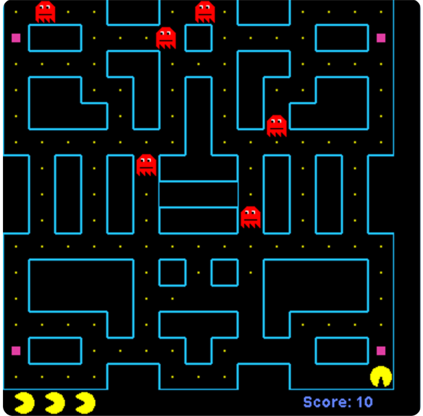

## PacMan

你需要使用Java语言开发一个PacMan GUI小游戏。

### 游戏说明:

●游戏中有PacMan， Ghost和FrightFruit三种对象，玩家需要控制PacMan消灭所有的Ghost，并且避免被Ghost消灭。Ghost 在游戏开始随机后出现，Ghost的移动由程序控制，你需要自己设计一个算法来控制Ghost的移动。FrightFruit 的数量由关卡决定，但地图中至少有一个FrightFruit。当最后一个FrightFruit被吃掉后需要随机刷新一个。
●当PacMan遇到FrightFruit时可以把FrightFruit吃掉。
●正常情况下，Ghost是红色的，如果这时PacMan同Ghost发生碰撞，则当前PacMan牺牲掉。玩家初始时有3个备用PacMan，当全部PacMan都牺牲时游戏失败。
●当PacMan吃到FrightFruit时，接下来3秒所有Ghost会变成蓝色，进入惊吓状态。这时PacMan可以趁乱消灭Ghost。3秒后，Ghost 恢复成红色。
●当所有Ghost都被消灭时，游戏成功，进入下一关卡。游戏界面如下:




#### 操作说明:

玩家使用键盘上的上下左右键控制PacMan移动。

#### 关卡说明:

你需要至少设计2关游戏，关卡难度递增。

### 提交格式

压缩包，文件内容包括：

- src 源码文件夹
- 打包完成的 jar 包
- pom.xml
- 课程报告.pdf

### 附录

```
<build>
    <plugins>
        <!-- 指定主类 和 打包相关依赖 -->
        <plugin>
            <groupId>org.apache.maven.plugins</groupId>
            <artifactId>maven-assembly-plugin</artifactId>
            <version>3.3.0</version>
            <configuration>
                <descriptorRefs>
                    <descriptorRef>jar-with-dependencies</descriptorRef>
                </descriptorRefs>
                <archive>
                    <manifest>
                        <mainClass>zgb.game.PacMan</mainClass>
                    </manifest>
                </archive>
            </configuration>
            <executions>
                <execution>
                    <id>make-assembly</id>
                    <phase>package</phase>
                    <goals>
                        <goal>single</goal>
                    </goals>
                </execution>
            </executions>
        </plugin>

    </plugins>
</build>
```

