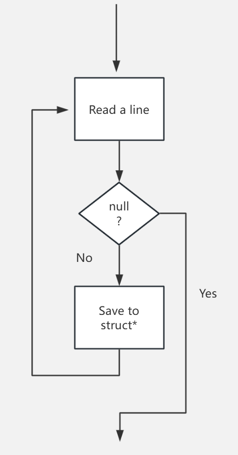
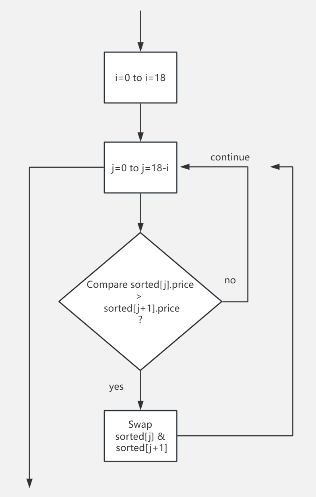
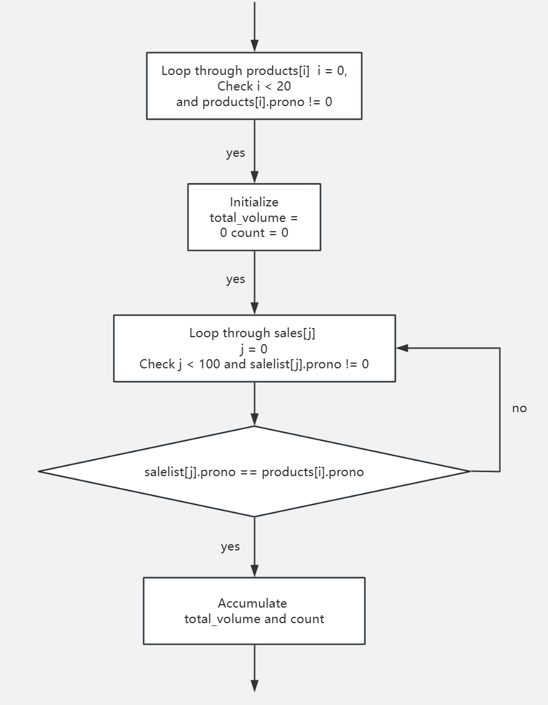
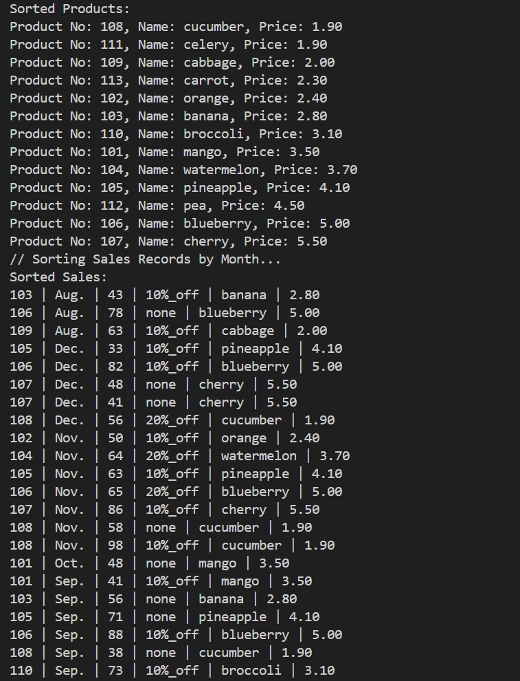
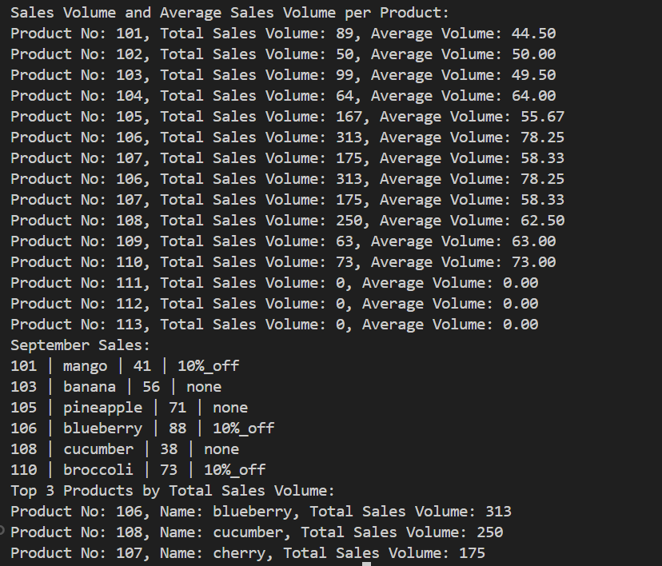

### Technical Report: Sales Management System Implementation

#### **Abstract**
This report details the design and implementation of a C-based Sales Management System. The system processes product and sales data from input files, provides sorting and display capabilities, and performs analytical tasks such as calculating sales volumes and identifying top-performing products. Additionally, the system outputs specific sales data into a file for further analysis. This implementation demonstrates robust handling of structured data using arrays, file I/O, and sorting algorithms.

---

#### **Introduction**
The Sales Management System is designed to:
1. Read product and sales data from files.
2. Sort and display records based on criteria (e.g., price, month).
3. Perform analytical tasks such as calculating sales volumes and averages.
4. Generate reports, including top-selling products and specific monthly sales data.

The primary goal is to provide a streamlined approach to managing and analyzing sales records for improved decision-making.

---

#### **System Design**

##### **Data Structures**
Two main structures are defined to represent products and sales records:
1. **`struct product`**:
   - Fields: `prono`, `fullname`, `price`.
   - Stores product information.

2. **`struct sale`**:
   - Fields: `prono`, `month`, `sales_volume`, `discount`.
   - Represents sales data associated with a product.

Both structures are stored in static arrays for efficient access.

##### **File Input**
The system reads data from two files:
1. **`product.txt`**:
   - Format: `prono fullname price`.
   - Contains product details.

2. **`salelist.txt`**:
   - Format: `prono month sales_volume discount`.
   - Contains sales records.

The first line of each file (header) is ignored during processing.

##### **Key Functionalities**

1. **Data Reading**:
   Functions `read_products()` and `read_sales()` load data from files into memory.
   
2. **Sorting**:
   - `sort_records_price()`: Sorts products by price in ascending order.
   - `sort_sales_month()`: Sorts sales records alphabetically by month.

3. **Displaying Records**:
   - `display_products()`: Displays products sorted by price.
   - `display_sales()`: Displays sales records with product information.

4. **Analysis**:
   - `calculate_sales_volume()`: Computes total and average sales volume per product.
   - `output_top_3_products()`: Identifies top 3 products by total sales volume.

5. **File Output**:
   - `output_sales_data()`: Writes all September sales data to `september_sales.txt`.

##### Flowcharts

**Read flowchart**



**Sort flowchart**



**Calculate flowchart**



---

#### **Implementation Details**

##### **Sorting Algorithms**

A bubble sort algorithm is implemented for both sorting functionalities due to its simplicity and small dataset size.

##### **File I/O**
The `fopen`, `fscanf`, and `fprintf` functions are used for file operations. Headers in input files are skipped using `fgets`.

##### **Dynamic Analysis**
The program dynamically determines the number of valid records in the input arrays, ensuring efficient processing.

##### **Data Integrity**
All operations ensure that data integrity is maintained by directly linking product and sales data via `prono`.

---

#### **Results**
The system successfully performs the following tasks:
1. **Product Sorting**:
   Displays products sorted by price.
   Output:
   
   ```
   Sorted Products:
   Product No: 108, Name: cucumber, Price: 1.90
   Product No: 111, Name: celery, Price: 1.90
   Product No: 109, Name: cabbage, Price: 2.00
   Product No: 113, Name: carrot, Price: 2.30
   Product No: 102, Name: orange, Price: 2.40
   Product No: 103, Name: banana, Price: 2.80
   Product No: 110, Name: broccoli, Price: 3.10
   Product No: 101, Name: mango, Price: 3.50
   Product No: 104, Name: watermelon, Price: 3.70
   Product No: 105, Name: pineapple, Price: 4.10
   Product No: 112, Name: pea, Price: 4.50
   Product No: 106, Name: blueberry, Price: 5.00
   Product No: 107, Name: cherry, Price: 5.50
   ```
   
2. **Sales Sorting**:
   Displays sales records sorted by month, enriched with product details.
   Output:
   
   ```
   Sorted Sales:
   103 | Aug. | 43 | 10%_off | banana | 2.80
   106 | Aug. | 78 | none | blueberry | 5.00
   109 | Aug. | 63 | 10%_off | cabbage | 2.00
   105 | Dec. | 33 | 10%_off | pineapple | 4.10
   106 | Dec. | 82 | 10%_off | blueberry | 5.00
   107 | Dec. | 48 | none | cherry | 5.50
   107 | Dec. | 41 | none | cherry | 5.50
   108 | Dec. | 56 | 20%_off | cucumber | 1.90
   102 | Nov. | 50 | 10%_off | orange | 2.40
   104 | Nov. | 64 | 20%_off | watermelon | 3.70
   105 | Nov. | 63 | 10%_off | pineapple | 4.10
   106 | Nov. | 65 | 20%_off | blueberry | 5.00
   107 | Nov. | 86 | 10%_off | cherry | 5.50
   108 | Nov. | 58 | none | cucumber | 1.90
   108 | Nov. | 98 | 10%_off | cucumber | 1.90
   101 | Oct. | 48 | none | mango | 3.50
   101 | Sep. | 41 | 10%_off | mango | 3.50
   103 | Sep. | 56 | none | banana | 2.80
   105 | Sep. | 71 | none | pineapple | 4.10
   106 | Sep. | 88 | 10%_off | blueberry | 5.00
   108 | Sep. | 38 | none | cucumber | 1.90
   110 | Sep. | 73 | 10%_off | broccoli | 3.10
   ```
   
3. **Sales Volume Calculation**:
   Computes and displays total and average sales volume for each product.
   Output:
   
   ```
   Sales Volume and Average Sales Volume per Product:
   Product No: 101, Total Sales Volume: 89, Average Volume: 44.50
   Product No: 102, Total Sales Volume: 50, Average Volume: 50.00
   Product No: 103, Total Sales Volume: 99, Average Volume: 49.50
   Product No: 104, Total Sales Volume: 64, Average Volume: 64.00
   Product No: 105, Total Sales Volume: 167, Average Volume: 55.67
   Product No: 106, Total Sales Volume: 313, Average Volume: 78.25
   Product No: 107, Total Sales Volume: 175, Average Volume: 58.33
   Product No: 108, Total Sales Volume: 250, Average Volume: 62.50
   Product No: 109, Total Sales Volume: 63, Average Volume: 63.00
   Product No: 110, Total Sales Volume: 73, Average Volume: 73.00
   Product No: 111, Total Sales Volume: 0, Average Volume: 0.00
   Product No: 112, Total Sales Volume: 0, Average Volume: 0.00
   Product No: 113, Total Sales Volume: 0, Average Volume: 0.00
   ```
   
4. **Top Products**:
   Outputs the top 3 products based on total sales volume.
   Output:
   
   ```
   Top 3 Products by Total Sales Volume:
   Product No: 106, Name: blueberry, Total Sales Volume: 313
   Product No: 108, Name: cucumber, Total Sales Volume: 250
   Product No: 107, Name: cherry, Total Sales Volume: 175
   ```
   
5. **File Generation**:
   Writes all September sales data into `september_sales.txt`.
   Output:
   
   ```
   September Sales:
   Product No: 101, Name: mango, Sales Volume: 41, Discount: 10%_off
   Product No: 103, Name: banana, Sales Volume: 56, Discount: none
   Product No: 105, Name: pineapple, Sales Volume: 71, Discount: none
   Product No: 106, Name: blueberry, Sales Volume: 88, Discount: 10%_off
   Product No: 108, Name: cucumber, Sales Volume: 38, Discount: none
   Product No: 110, Name: broccoli, Sales Volume: 73, Discount: 10%_off
   ```

**Screenshot**





---

#### **Conclusion**

The Sales Management System demonstrates the efficient use of C programming for managing and analyzing structured data. It highlights core concepts such as file I/O, structure manipulation, and sorting. Future enhancements could include dynamic memory allocation for handling larger datasets and more advanced sorting algorithms for improved performance.